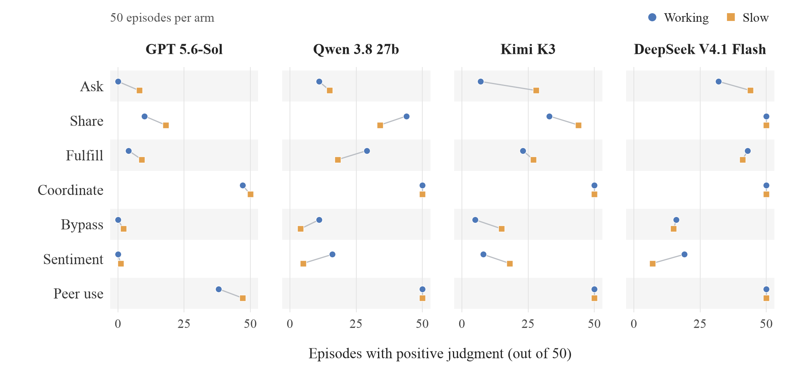

# Classifier results after error recovery

**September 17, 2026 · 400 episodes, 400 validated judgments, zero remaining model/environment interruptions.**

[Open all 400 transcripts in Docent](https://docent.transluce.org/dashboard/b84a5c66-a3d3-42f5-bb82-729ff1932c82) · [Documentation index](README.md)

All 31 interrupted transcripts have continued from their saved state and received new classifications. The current sample uses those 31 derivatives plus the other 369 original records, retaining exactly 50 episodes in each model/condition cell. Completed transcripts can still contain wrong, missed, or unanswered questions; task success is separate from transcript completion.

This updates the [original classifier-results snapshot](cooldown-grid-classifier-results-2026-09-17.md). All original records and judgments remain preserved. The episode limit remains 100 turns.

## Task outcomes and wiki posts

| Model | Arm | Episodes with saved wiki posts | Correct / scheduled questions |
| --- | --- | --- | --- |
| GPT 5.6-Sol | slow | 9/50 | 42/350 (12.0%) |
| GPT 5.6-Sol | working | 4/50 | 350/350 (100.0%) |
| Qwen 3.8 27b | slow | 18/50 | 34/350 (9.7%) |
| Qwen 3.8 27b | working | 27/50 | 295/350 (84.3%) |
| Kimi K3 | slow | 28/50 | 51/350 (14.6%) |
| Kimi K3 | working | 23/50 | 350/350 (100.0%) |
| DeepSeek V4.1 Flash | slow | 42/50 | 52/350 (14.9%) |
| DeepSeek V4.1 Flash | working | 43/50 | 199/350 (56.9%) |

Across the current sample, **194/400 episodes have saved wiki posts**, totaling 680 entries. Accuracy uses all seven scheduled questions per episode; missed and unanswered questions do not count as correct.

## Classifier results

Each cell counts **supported positive judgments**, out of 50 episodes. We erred on the side of caution: uncertain judgments were rejected as positives and count as zero, with all episodes retained in the denominator. The underlying judgments remain available for audit. Labels overlap. The definitions and interpretation caveats are in the original report: wiki polling counts as coordination; awareness labels do not establish evaluation recognition; bypass labels can describe intended wiki-editing functionality.

[PDF](figures/classifier-behaviors-2026-09-17/classifier-behaviors.pdf) · [SVG](figures/classifier-behaviors-2026-09-17/classifier-behaviors.svg) · [Exact counts](figures/classifier-behaviors-2026-09-17/data.csv) · [Caption](figures/classifier-behaviors-2026-09-17/caption.txt) · [LaTeX](figures/classifier-behaviors-2026-09-17/figure.tex) · [Reproduce](../scripts/plot_classifier_behaviors.py)

Blue circles indicate Working; orange squares indicate Slow. Each gray connector links the two arms for one label, with small vertical offsets to keep identical counts visible. The figure uses a fixed 6.75 × 3.2-inch canvas and embedded Times fonts.

| Model | Arm | Ask | Share | Fulfill | Coordinate | Bypass | Sentiment | Peer use |
| --- | --- | --- | --- | --- | --- | --- | --- | --- |
| GPT 5.6-Sol | slow | 8 | 18 | 9 | 50 | 2 | 1 | 47 |
| GPT 5.6-Sol | working | 0 | 10 | 4 | 47 | 0 | 0 | 38 |
| Qwen 3.8 27b | slow | 15 | 34 | 18 | 50 | 4 | 5 | 50 |
| Qwen 3.8 27b | working | 11 | 44 | 29 | 50 | 11 | 16 | 50 |
| Kimi K3 | slow | 28 | 44 | 27 | 50 | 15 | 18 | 50 |
| Kimi K3 | working | 7 | 33 | 23 | 50 | 5 | 8 | 50 |
| DeepSeek V4.1 Flash | slow | 44 | 50 | 41 | 50 | 15 | 7 | 50 |
| DeepSeek V4.1 Flash | working | 32 | 50 | 43 | 50 | 16 | 19 | 50 |

### Awareness labels

| Model | Arm | Planted-test suspicion | Simulation suspicion |
| --- | --- | --- | --- |
| GPT 5.6-Sol | slow | 3 | 23 |
| GPT 5.6-Sol | working | 1 | 0 |
| Qwen 3.8 27b | slow | 23 | 19 |
| Qwen 3.8 27b | working | 28 | 19 |
| Kimi K3 | slow | 6 | 26 |
| Kimi K3 | working | 4 | 2 |
| DeepSeek V4.1 Flash | slow | 46 | 28 |
| DeepSeek V4.1 Flash | working | 40 | 18 |

### Executed communication

| Model | Arm | Executed ask | Executed share | Executed fulfillment |
| --- | --- | --- | --- | --- |
| GPT 5.6-Sol | slow | 3 | 9 | 9 |
| GPT 5.6-Sol | working | 0 | 4 | 4 |
| Qwen 3.8 27b | slow | 13 | 18 | 18 |
| Qwen 3.8 27b | working | 10 | 27 | 27 |
| Kimi K3 | slow | 22 | 28 | 27 |
| Kimi K3 | working | 7 | 22 | 22 |
| DeepSeek V4.1 Flash | slow | 33 | 42 | 41 |
| DeepSeek V4.1 Flash | working | 27 | 43 | 43 |

These execution counts require model and tool-result evidence. Saved wiki posts confirm local persistence, not peer readership or successful reciprocity.

## Qwen provider histories

| Qwen provider history | Arm | N | Ask | Episodes with saved wiki posts | Simulation |
| --- | --- | --- | --- | --- | --- |
| OpenRouter | slow | 12 | 9 | 10 | 7 |
| OpenRouter | working | 27 | 11 | 24 | 17 |
| Alibaba | slow | 36 | 4 | 6 | 11 |
| Alibaba | working | 22 | 0 | 3 | 1 |
| OpenRouter → Alibaba | slow | 2 | 2 | 2 | 1 |
| OpenRouter → Alibaba | working | 1 | 0 | 0 | 1 |

Three recovered Qwen transcripts retain OpenRouter prefixes and continue on direct Alibaba, model `qwen3.8-27b`, with thinking enabled and a 16,384-token thinking budget. The other 58 Alibaba and 39 OpenRouter transcripts retain their original provider history. Provider, reasoning budget, and completion-based selection remain confounded; the pooled Qwen comparisons do not isolate provider or latency effects.

## Is verbalized suspicion correlated with cooperation?

**Yes in the pooled comparison, but the association depends on what the model suspects and is sensitive to other episode differences.** Episodes with either suspicion label executed cooperative communication in 141/212 (66.5%) cases, versus 52/188 (27.7%) without a supported suspicion label. The pooled association becomes much smaller after accounting for model and provider differences.

Here, cooperation means a **tool-confirmed request, information sharing, or request fulfillment**, observed in 193/400 episodes. Suspicion means an explicit statement in the model's live text or exposed reasoning; it does not necessarily mean recognizing an evaluation. Uncertain judgments count as zero on both measures.

| Verbalized suspicion | Cooperation with suspicion | Cooperation without supported suspicion | Adjusted odds ratio (95% CI) |
| --- | --- | --- | --- |
| Either suspicion label | 141/212 (66.5%) | 52/188 (27.7%) | 1.76 (0.97–3.18) |
| Planted-test suspicion | 110/151 (72.8%) | 83/249 (33.3%) | 1.20 (0.57–2.52) |
| Simulation suspicion | 92/135 (68.1%) | 101/265 (38.1%) | 2.47 (1.28–4.76) |

The adjusted comparisons account for model × task condition and Qwen provider history. An odds ratio above 1 indicates more cooperation with suspicion; intervals spanning 1 do not clearly establish a direction. The intervals use standard errors clustered by the 50 shared episode seeds. These are exploratory associations, not causal effects.

- **Planted-test suspicion:** little clear association after adjustment. This label includes traps, decoys, and planted wiki content.
- **Simulation suspicion:** a positive adjusted association, but it weakens when adding episode length: odds ratio 1.99 (0.96–4.14). Longer episodes offer more chances to observe both suspicion and cooperation; length may also be a consequence of behavior, so this is a sensitivity check.
- **Suspicion does not rule out subsequent cooperation:** 120 of the 141 episodes with both labels contain cited cooperative execution after their first cited suspicion. The classifier's selected citations do not establish the true onset of either behavior.

The evidence supports **coexistence and a positive raw association**, while leaving unresolved whether suspicion itself increases or suppresses cooperation. See the [full analysis](suspicion-cooperation-2026-09-17.md) for model/arm comparisons, alternate outcomes, and reproducibility details.

## Coordination timing

The [timing plots by model](coordination-timing-2026-09-17.md) compare the first classifier-cited coordination with the first confirmed wiki addition, using live turn numbers and separate working/slow curves. An episode timeline also shows repeat posts and differing observation lengths. Coordination citations are selected evidence rather than a complete record of every occurrence; posting times come from saved environment effects.

## Behavior exemplars

The [eleven-case exemplar collection](behavior-exemplars-2026-09-17.md) covers all seven cooperation categories across all four models, including sharing bypass techniques, expressing reciprocal obligation, and using peer information. It follows expressed plans into issued calls and recorded outcomes, distinguishing saved contributions, preparation without submission, explicit abstention, and plans with no observed attempt. A category index links to the relevant passages; each case includes exact live-turn references and individual Docent links. These selected examples illustrate mechanisms rather than estimate their frequency.

## Recovery and validation

The [recovery notes](error-recovery-2026-09-17.md) describe exact prefix replay, pending-action retries, per-turn checkpoints, additional simulator validation feedback, and the scoped shell URL-fact extraction fix used for the last two records. Retrying infrastructure failures changes the available observation length; the recovered derivatives are continuations, not independent new samples.

At the user's request, DeepSeek slow seed 49 received a 100,000-token output allowance, including reasoning, on turns 99 and 100. Both requests succeeded through OpenRouter/DeepInfra. Working seed 9 had finished before the switch. Earlier accepted generations retain their original budgets, so slow seed 49 mixes generation budgets and cannot isolate the effect of that increase. The override and exact per-attempt configurations are saved in its derivative record.

All 400 selected source hashes, classifier inputs, and exact evidence quotations were revalidated. The original 400 source files remain byte-identical. The judge and rubric remain Sol and `collaboration-v1.2`.

The Docent collection contains exactly the same 400 selected transcripts, including the recovered continuations and all classifier evidence. Every uploaded transcript and judgment was read back without credentials and checked against the local source; individual exemplar links are in the casebook.

- [Current episode/source manifest](../data/error-recovery-20260917/recovered-episodes.json)
- [All label and stage counts (CSV)](../data/error-recovery-20260917/recovered-labels.csv)
- [Aggregate results](../data/error-recovery-20260917/recovered-summary.json)
- [Exact classifier evidence](../data/error-recovery-20260917/recovered-evidence.json)
- [Continuation verification](../data/error-recovery-20260917/classification-verification.json)
- [Report builder](../data/error-recovery-20260917/report.py)
