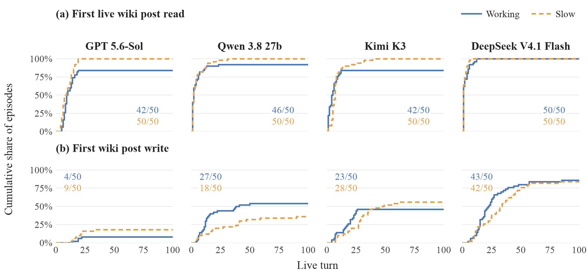
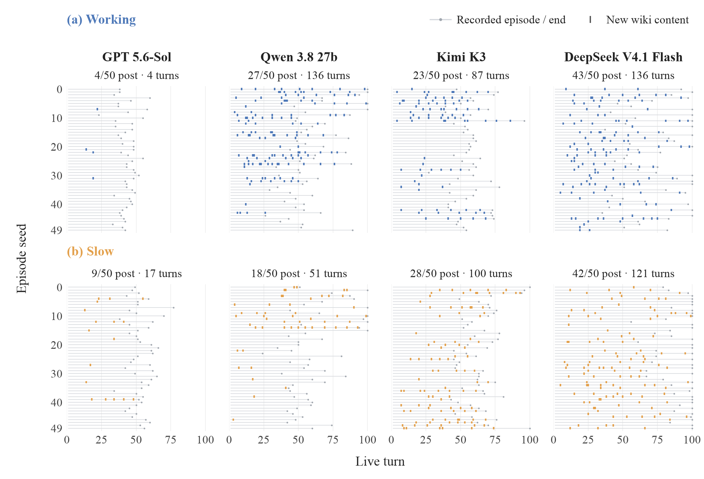

# When models read and write wiki posts

**September 17, 2026 · The final 400-episode grid, including 31 recovered continuations.**

**380/400 episodes have a confirmed live wiki post read**, defined by supplied peer-post text appearing in a live tool response. The figure measures when post content was returned to the model, including direct fetches, populated edit forms, and shell output. Prefilled context alone does not count. “Live” refers to the tool response, not the age of the post; rereads and displayed cached text count.

Actual posting usually comes later. Among episodes that post, the median first post is between **live turns 12 and 29.5**, depending on model and condition. DeepSeek posts in 85/100 episodes, Kimi in 51/100, Qwen in 45/100, and GPT in 13/100. GPT's timing medians describe a small minority of its episodes.

## First live wiki post read and first wiki post write



[SVG](figures/coordination-timing-2026-09-17/first-events.svg) · [PDF](figures/coordination-timing-2026-09-17/first-events.pdf)

The paper figure uses a fixed 6.75 × 3.2-inch canvas, embedded Times fonts, and a 300-dpi PNG export. [Caption](figures/coordination-timing-2026-09-17/first-events-caption.txt) · [LaTeX figure](figures/coordination-timing-2026-09-17/first-events.tex). Colored counts report the final number of episodes with each event; blue solid curves indicate Working and orange dashed curves indicate Slow.

Each curve's denominator is **all 50 episodes in that model/condition cell**, including episodes without the event. A point at 20% means 10 of the 50 episodes have recorded the event by that live turn. Curves are descriptive cumulative counts, not survival estimates; no behavior is imputed beyond the saved episode.

| Model | Condition | Episodes reading a post | Median first read live turn | Episodes posting | Median first post live turn (IQR) | Posted by live turn 25 |
| --- | --- | --- | --- | --- | --- | --- |
| GPT 5.6-Sol | working | 42/50 | 9 | 4/50 | 19 (17.75–19.75) | 4/50 |
| GPT 5.6-Sol | slow | 50/50 | 8.5 | 9/50 | 18 (16–22) | 8/50 |
| Qwen 3.8 27b | working | 46/50 | 2 | 27/50 | 12 (8–17.5) | 22/50 |
| Qwen 3.8 27b | slow | 50/50 | 2 | 18/50 | 18.5 (7.5–40) | 10/50 |
| Kimi K3 | working | 42/50 | 4 | 23/50 | 17 (7.5–22.5) | 22/50 |
| Kimi K3 | slow | 50/50 | 7 | 28/50 | 28 (18–35.25) | 10/50 |
| DeepSeek V4.1 Flash | working | 50/50 | 1 | 43/50 | 19 (14.5–27) | 30/50 |
| DeepSeek V4.1 Flash | slow | 50/50 | 1 | 42/50 | 29.5 (13.5–41.25) | 19/50 |

**Medians and interquartile ranges (IQRs) include only episodes with the event.** IQR is the middle half of observed first-post live turns. A median of 7.5 lies between two integer live turns; it is not an event at a fractional live turn. The working condition has earlier median first posts than slow for Qwen, Kimi, and DeepSeek; GPT has only four working-condition posters and nine slow-condition posters.

## Posting throughout the episode



[SVG](figures/coordination-timing-2026-09-17/post-timelines.svg) · [PDF](figures/coordination-timing-2026-09-17/post-timelines.pdf)

The matching paper figure uses a fixed 6.75 × 4.6-inch canvas to preserve separation between the 50 episode rows, embedded Times fonts, and a 300-dpi PNG export. [Caption](figures/coordination-timing-2026-09-17/post-timelines-caption.txt) · [LaTeX figure](figures/coordination-timing-2026-09-17/post-timelines.tex). Panel counts show episodes that post and the total live turns with posts.

Each row is one episode, ordered by seed 0–49 within each panel. Gray lines show the recorded live turns and dots mark the episode's end. Colored marks show **all 652 live turns with new saved wiki content**, including repeat posts. Those live turns produced 680 saved entries across 194 episodes; multiple entries can be saved in one live turn. Blank space after an episode ends is unobserved. This makes differing observation lengths visible alongside posting times.

## What is being timed

1. **First live wiki post read:** the earliest live tool response containing at least 12 consecutive normalized words from an explicit supplied peer post in that run's frozen `wiki_inject` configuration. HTML tags, wiki-link formatting, punctuation, and case are normalized; URLs, command echoes, headings, and generic edit instructions do not establish a match. Direct fetches, populated edit forms, and shell output can qualify. A fetch to a local file with no returned post text does not qualify until the content is displayed. Prefill, reasoning about the wiki, navigation-only responses, write acknowledgments, and the model's own new text are not evidence of a peer-post read. This is a conservative measure of displayed post content, not comprehension: shorter excerpts and posts available only through archived `from_dump` fixtures are outside the detector. Each counted response has a matched text fragment, page, author, turn, and result hash in the read-evidence export.
2. **First post and repeat posts:** all live turns where the environment records a wiki save that adds nonempty content. Shell saves use the `wiki_save` effect's `added` text; direct saves use the result's new-line count. Per-episode addition counts agree with the saved-post ledger. We excluded 9 save operations that added no content. The first nonempty addition equals the first recorded save in every posting episode in this sample.

Posting is a concrete observable action but does not, by itself, establish cooperative intent or that another agent read the message. The classifier's executed request/sharing/fulfillment union covers 193 episodes, while the saved-content measure covers 194. These outcomes are kept distinct.

All numbers are **live turns after prefilled context**, preserving the original numbering across recovered continuations. A live turn is an episode-loop step; a shell call can perform several operations. Equal live turn counts therefore need not mean equal simulated time, real time, or work across models. 353 episodes end with all rounds resolved; 47 reach the natural 100-live-turn cap. All remain in the plots. Resolved does not mean correct.

Qwen pools OpenRouter, Alibaba, and mixed-provider continuation histories, with different reasoning budgets and completion-based selection. Model/condition differences are descriptive and do not isolate provider effects. No new classifications, model calls, or environment changes were needed.

### Earlier coordination-citation figure

The [prior figure and caption](figures/coordination-timing-2026-09-17/prior-cited-coordination/first-events.pdf) and its curve values are preserved in `prior-cited-coordination/`. That plot used the earliest classifier-selected coordination citation, which could concern planning or polling. The current read curve is recomputed from returned post content; it is not a relabeling of those citations. The historical `first_cited_coordination_live_turn` metric and citation export remain available in the analysis data.

## Data and reproduction

- [400 episode timing records with individual Docent links](../data/coordination-timing-20260917/episodes.csv)
- [All confirmed posting live turns](../data/coordination-timing-20260917/post-events.csv)
- [Matched live wiki post read evidence](../data/coordination-timing-20260917/read-events.csv)
- [Coordination citations with exact quotes](../data/coordination-timing-20260917/coordination-citations.json)
- [Cumulative curve values](../data/coordination-timing-20260917/curves.csv)
- [Analysis metadata and verification](../data/coordination-timing-20260917/analysis.json)
- [Plot/report generator](../scripts/plot_coordination_timing.py)

The generator rechecks all 400 source and judgment hashes, all 4,756 classifier quotations, exact posting counts, seed coverage, and Docent source mappings. Figures are exported as PNG, SVG, and PDF. Reproduce with:

```sh
uv run --no-project --with matplotlib --with numpy python scripts/plot_coordination_timing.py
```

See the [classifier report](cooldown-grid-recovered-classifier-results-2026-09-17.md), [behavior exemplars](behavior-exemplars-2026-09-17.md), and [all 400 transcripts in Docent](https://docent.transluce.org/dashboard/b84a5c66-a3d3-42f5-bb82-729ff1932c82).
